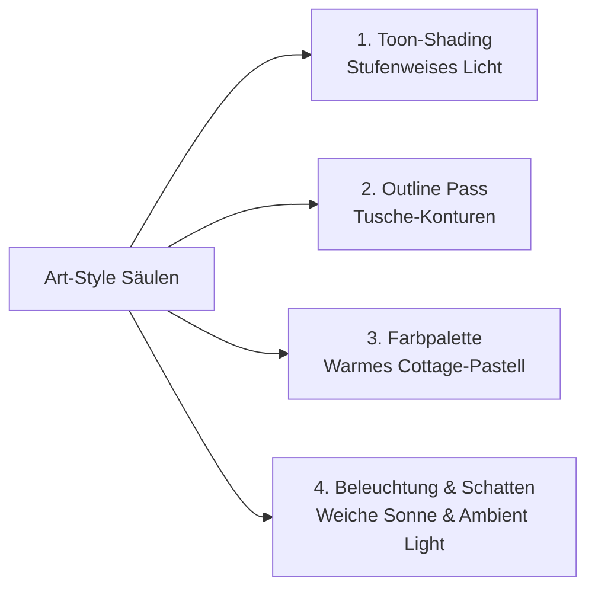

# 🎨 FALTALITY: Visual Overhaul Plan ("Untitled Goose Game" Indie Art-Style)

Dieses Dokument beschreibt die Architektur und schrittweise Umsetzung des visuellen Relaunchs von **FALTALITY** direkt in Three.js, um den ikonischen Bilderbuch- und Cel-Shading-Stil von *Untitled Goose Game* und modernen Low-Poly-Indie-Hits zu erreichen.

---

## 1. Unity WebGL vs. Three.js: Was wäre wenn?

> **Ja, absolut machbar!** Wenn du dir die Zeit nehmen möchtest, dich in Unity einzuarbeiten:
> - **Entwicklungsweg:** Unity (Version 6 / 2023 LTS) mit **URP (Universal Render Pipeline)**. Mit dem visuellen *Shader Graph* kannst du Cel-Shading und Outlines per Klick zusammenbauen, Physik per RigidBody/PhysX steuern und Kamerafahrten mit *Cinemachine* animieren.
> - **Browser-Export:** Über *File > Build Profiles > WebGL*. Unity generiert HTML, JS und WebAssembly (.wasm).
> - **Hosting:** Funktioniert nahtlos mit deinem bestehenden Docker/Nginx-Container (einfach die komprimierten WebGL-Build-Dateien ausliefern).
> - **Typischer Einsatzzweck:** Perfekt, wenn du später auch auf **Steam (PC/Mac)**, Nintendo Switch oder iOS/Android veröffentlichen möchtest.

Für den sofortigen lokalen Relaunch in unserem bestehenden Codebase können wir denselben Look in **Three.js** mit minimalem Overhead und ohne Ladezeitenverlust realisieren!

---

## 2. Die 4 Säulen des "Untitled Goose Game"-Stils

### Säule 1: Cel-Shading / Toon-Shading mit diskreten Tonwert-Stufen
- **Aktueller Zustand:** `MeshLambertMaterial` und `MeshStandardMaterial` berechnen lineare, stufenlose Helligkeitsverläufe über die Polygone.
- **Neuer Look:** `THREE.MeshToonMaterial` mit einer winzigen 3- oder 4-Stufen-`gradientMap` (DataTexture).
  - Volles Licht (100% Farbwert)
  - Halbschatten (75% Farbwert)
  - Kernschatten (45% Farbwert)
- **Ergebnis:** Jeder Gegenstand (Blatt Papier, Tisch, Schafe, Vögel, Zaun) sieht sofort handgezeichnet und wie aus einer Cartoon-Illustration aus.

### Säule 2: Scharfe Tusche-Konturen (Edge Detection / Outlines)
- *Untitled Goose Game* nutzt feine, dunkle Umrisslinien um Objekt-Silhouetten.
- **Umsetzung:** 
  - Entweder über Three.js `EffectComposer` mit einem `OutlinePass` bzw. Custom Sobel-Normal-Depth Shader.
  - Oder (noch performanter & artefaktfrei) über einen **Inverted Hull Outline Shader** auf Objekten wie dem Papierflieger, Vögeln und Schafen.

### Säule 3: "British Garden"-Farbpalette (House House Palette)
- Weg von sterilen RGB-Primärfarben, hin zu organischen, matten Farbtönen:
  - **Rasen:** Sanftes Moosgrün (`#698b5a`) statt grellem Grasgrün
  - **Tisch:** Warmes Buchen-/Honigholz (`#d29858`)
  - **Himmel:** Helles Dunst-Pastellblau (`#bcd7e8`) statt Neonhimmel
  - **Zaun & Häuser:** Ziegelrot (`#a84b39`) und mattes Cremeweiß (`#eae4d9`)
  - **Papier:** Echtes Natur-Zellstoff-Weiß (`#fdfbf7`)

### Säule 4: Warme Sonnen-Atmosphäre (Lighting & Shadows)
- **Directional Light:** Wärmeres Sonnenlicht (`#fff5e4`) in flachem 45°-Winkel für lange, malerische Schatten.
- **Hemisphere Light:** Himmelblau von oben (`#dce8f5`), warmes Reflexionsgrün vom Boden (`#7c8c62`) für weiche Aufhellung aller Schatten.

---

## 3. Schritt-für-Schritt Umsetzungsplan (Lokal)

| Phase | Aufgabe | Betroffene Module | Aufwand |
| :--- | :--- | :--- | :--- |
| **Step 1** | **Toon Gradient Map & Material Factory** Erstellen einer universellen Gradient-Texture für `MeshToonMaterial`, damit alle Modelle automatisch im Cel-Shading rendern. | `src/models/materials.ts` *(neu)* | ~20 Min |
| **Step 2** | **Cottage-Farbkorrektur & Beleuchtung** Anpassen der Garten-, Zaun-, Haus- und Schaf-Farben an die matte englische Bilderbuch-Palette. Sonnenlicht optimieren. | `src/models/environment.ts` `src/game.ts` | ~30 Min |
| **Step 3** | **Paper & Bird Toon-Conversion** Papierblatt, Faltstufen, Tauben, Kraniche und Schafe auf das Toon-Material umstellen. | `src/models/paper.ts` `src/models/birds.ts` | ~30 Min |
| **Step 4** | **Subtile Kanten-Outlines** Hinzufügen diskreter Silhouetten-Konturen (Inverted Hull / Post-Processing). | `src/game.ts` | ~25 Min |
| **Step 5** | **Feinschliff & Performance-Check** FPS-Prüfung (stabiles 60 FPS) und visuelle Harmonisierung der Faltality-Effekte (Konfetti & Koffer). | `src/main.ts` | ~15 Min |

---

## 4. Bereit für die lokale Umsetzung?
Sobald du das Go gibst, fangen wir mit **Step 1 & 2** an (GradientMap-System + stimmungsvolle Cottage-Beleuchtung & Farbpalette) und begutachten das Ergebnis direkt auf deinem lokalen Dev-Server!
